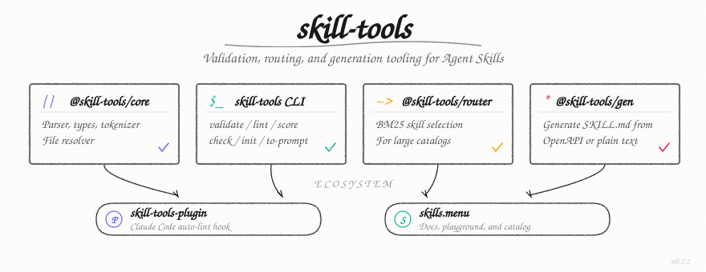

# skill-tools

<p align="center">
  
</p>

Validation, routing, and generation tooling for [Agent Skills](https://agentskills.io) (SKILL.md).

## Packages

| Package | npm | Description |
|---------|-----|-------------|
| [`@skill-tools/core`](packages/core) | `npm i @skill-tools/core` | Parser, types, tokenizer, file resolver |
| [`skill-tools`](packages/skill-tools) | `npm i -g skill-tools` | CLI — validate, lint, score, init, to-prompt |
| [`@skill-tools/router`](packages/router) | `npm i @skill-tools/router` | BM25 skill selection for large catalogs |
| [`@skill-tools/gen`](packages/gen) | `npm i @skill-tools/gen` | Generate SKILL.md from OpenAPI specs or text |

## Quick Start

```bash
# Install the CLI
npm install -g skill-tools

# Validate a skill
skill-tools validate ./my-skill/

# Lint for quality issues
skill-tools lint ./my-skill/

# Score 0-100 across 5 dimensions
skill-tools score ./my-skill/

# All three in one pass (ideal for CI)
skill-tools check ./my-skill/

# Scaffold a new skill
skill-tools init my-new-skill

# Generate XML prompt from skills (for agent system prompts)
skill-tools to-prompt ./skills/
```

## Programmatic Usage

```typescript
import { parseSkill, resolveSkillFiles } from '@skill-tools/core';

const files = await resolveSkillFiles('./skills/');
for (const loc of files) {
  const result = await parseSkill(loc.skillFile);
  if (result.ok) {
    console.log(result.skill.metadata.name);
  }
}
```

## Development

```bash
pnpm install        # Install dependencies
pnpm build          # Build all packages
pnpm test           # Run all tests
pnpm check          # lint + typecheck + test
```

Requires Node.js >= 18 and pnpm >= 9.

## What are Agent Skills?

Agent Skills are a portable, vendor-neutral format for packaging AI agent capabilities as `SKILL.md` files. See the [specification](https://agentskills.io/specification) and [skills.menu](https://skills.menu) for details.

## License

Apache-2.0
